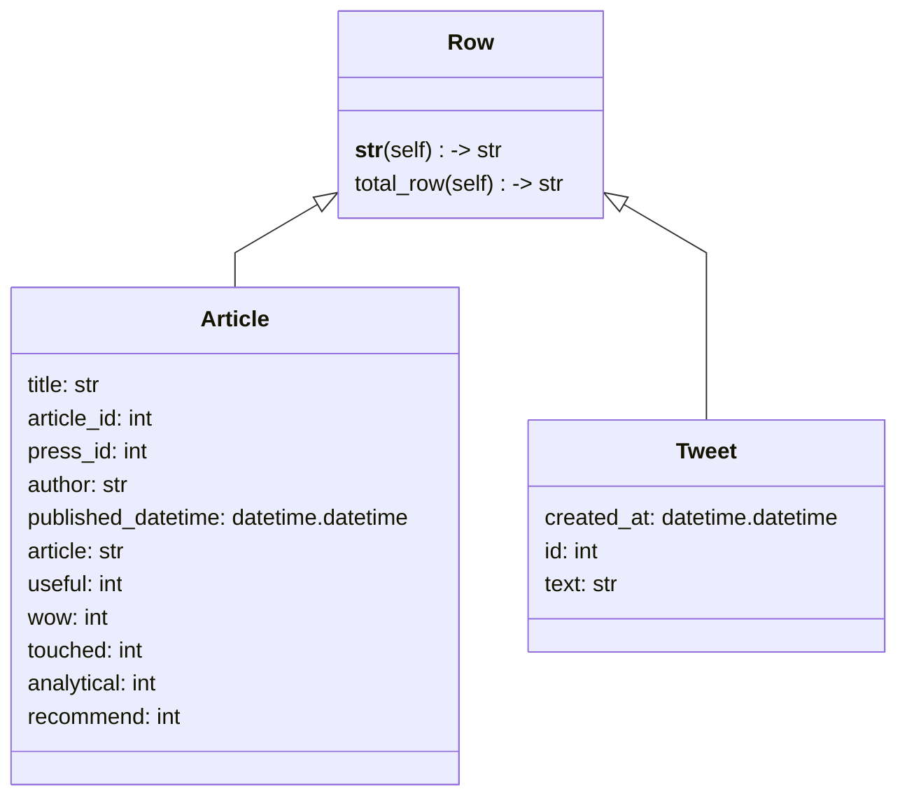

# items.py
## `Row`
기본적인 데이터 인터페이스용 클래스

주의점)
- `Row` 클래스를 상속받는 자식클래스의 필드 attribution에는 무조건 DB의 필드만 들어가야함.

## `Article(Row)`

- SQL 설정 및 출력
```sql
> #article table create

> CREATE TABLE article (article_No int(7) zerofill, article_id int not null, press_id int not null, title text not null, author text not null, published_datetime datetime not null, article text not null, useful int(5) zerofill, wow int (5) zerofill, touched int(5) zerofill, analytical int(5) zerofill, recommend int(5) zerofill);

> # result

+--------------------+--------------------------+------+-----+---------+-------+
| Field              | Type                     | Null | Key | Default | Extra |
+--------------------+--------------------------+------+-----+---------+-------+
| article_No         | int(7) unsigned zerofill | YES  |     | NULL    |       |
| article_id         | int                      | NO   |     | NULL    |       |
| press_id           | int                      | NO   |     | NULL    |       |
| title              | text                     | NO   |     | NULL    |       |
| author             | text                     | NO   |     | NULL    |       |
| published_datetime | datetime                 | NO   |     | NULL    |       |
| article            | text                     | NO   |     | NULL    |       |
| useful             | int(5) unsigned zerofill | YES  |     | NULL    |       |
| wow                | int(5) unsigned zerofill | YES  |     | NULL    |       |
| touched            | int(5) unsigned zerofill | YES  |     | NULL    |       |
| analytical         | int(5) unsigned zerofill | YES  |     | NULL    |       |
| recommend          | int(5) unsigned zerofill | YES  |     | NULL    |       |
+--------------------+--------------------------+------+-----+---------+-------+

```

## `Tweet(Row)`

- SQL 설정 및 출력
```sql

#tweet table create

create table twitter (tweet_No int(7) zerofill, tweet_id int not null, tweet text not null, posted_datetime datetime not null)

#result

+-----------------+--------------------------+------+-----+---------+-------+
| Field           | Type                     | Null | Key | Default | Extra |
+-----------------+--------------------------+------+-----+---------+-------+
| tweet_No        | int(7) unsigned zerofill | YES  |     | NULL    |       |
| posted_datetime | datetime                 | NO   |     | NULL    |       |
| tweet_id        | int                      | NO   |     | NULL    |       |
| tweet           | text                     | NO   |     | NULL    |       |
+-----------------+--------------------------+------+-----+---------+-------+
```

## `Community(Row)`


# SQL_DB.py

# Class Diagram

