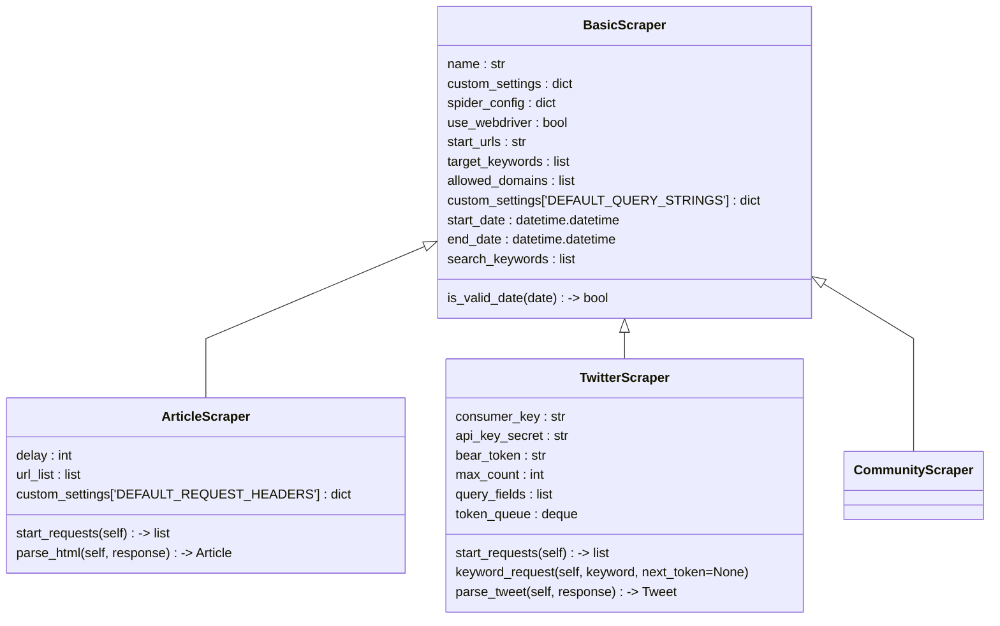

# 유의사항
## TwitterScraper
- url과 같이 학습에 악영향을 미칠 수 있는 부분이 제거가 안된 상태이므로 주의하기.

## CommunityScraper
- url과 같이 학습에 악영향을 미칠 수 있는 부분이 제거가 안된 상태이므로 주의하기.
- `author` 필드에 결측값이 있을 수 있음.

# 세부 사항
## BasicScraper
spider-designation.yaml을 읽음.

|||
|-|-|
|YAML에 추가할 종류|세부적인 크롤링 목적에 따라서 유동적으로 변할 수 있는 것들|
|하드코딩 혹은 추가 설정 파일에 기입해야할 종류|웹페이지 구조와 같이 사용자가 알 필요 없는 구현 세부사항|

### yaml 필수 키워드
- `start_urls` : list \
    크롤링 시작 url
- `target_keywords` : list \
    목적 키워드
- `allowed_domains` : list \
    접근이 허용된 도메인
- `delay` : str \
    특정 페이지 파싱 후 대기 시간
    - 숫자: 입력된 숫자(초 단위)로 대기
    - Normal Dist: 정규분포 대기시간 동안 대기 (mean: 2s, std. div.: 1s). 무조건 0.2 보다는 큼
- `search_keywords` : list \
    검색 키워드
- `start_date` : str \
    시작 년도
    형식 : YYYY-MM-DD HH:MM:SS
- `end_date` : str \
    끝 년도
    형식 : YYYY-MM-DD HH:MM:SS

## ArticleScraper
> Target: [네이버 뉴스](https://news.naver.com/)
### 파싱 필드
> 2022-04 이후에만 적용

|종류|이름|타입|Description|
|-|-|-|-|
|제목|title|str|
|기사 id|article_id|int|마지막 10자리|
|신문사 id|press_id|int|article/뒤 3자리|
|기자|author|str|
|날짜|published_datetime|datetime|형식: YYYY-MM-DD HH:MM:SS|
|본문|article|str||
|쏠쏠정보|useful|int||
|흥미진진|wow|int||
|공감백배|touched|int||
|분석탁월|analytical|int||
|후속강추|recommend|int||

### yaml 필수 키워드
- 요구 사항)
    - `start_urls`의 첫 원소는 api에 대한 url이어야 함.
- 필수 키워드)
    - `use_webdriver` : bool \
        기본 : `False`
        - `True`일 경우: `selenium.wedriver.Chrome`을 이용한 동적 스크랩핑
        - `False`일 경우: `requests.get`을 이용한 정적 스크랩핑
    - `display` : int \
        최대로 표시할 개수
    - `Naver_Client_Id`, `Naver_Client_Secret` : str \
        네이버 API 접근시 필요.

## CommunityScraper
> Target: [네이버 종목토론방](https://finance.naver.com/)

## 파싱 필드
|종류|이름|타입|Description|
|-|-|-|-|
|제목|title|str||
|생성일|created_at|datetime||
|본문|text|str||
|조회수|views|int||
|좋아요 수|good|int||
|싫어요 수|bad|int||

## yaml 필수 키워드
- 요구 사항)
    - `allowed_domains`에는 크롤링하려는 사이트의 도메인이 들어가야한다.
    - `start_url`에는 종목토론방의 url이 들어가야한다.

- 필수 키워드)
    - `ticker`: **str** \
        주식 인덱스(국내: 6자리 종목 코드, 미국: 약자)

## TwitterScraper
### 파싱 필드
|종류|이름|타입|Description|
|-|-|-|-|
|생성일|created_at|datetime||
|트윗 아이디|id|int||
|본문|text|str||

### yaml 필수 키워드
- 요구 사항)
    - `start_url`의 첫번째 원소에는 API URL이 들어가야 함.
    - `target_keywards`에는 원하는 헤시태그 입력 (`#`은 제외)
    - `search_keywards`에는 원하는 검색어 입력

> Note. `target_keywards`와 `search_keywards`는 쿼리 결과의 중복을 초래할 수 있으므로 적절히 사용하기

- 필수 키워드)
    - `count` : int \
        불러올 항목의 개수
    - `query_fields` : str \
        구분자: '.'
    - `consumer_key` : str
    - `consumer_secret` : str
    - `bearer_token` : str
    - `access_token` : str
    - `access_token_secret` : str

# Class Diagram

